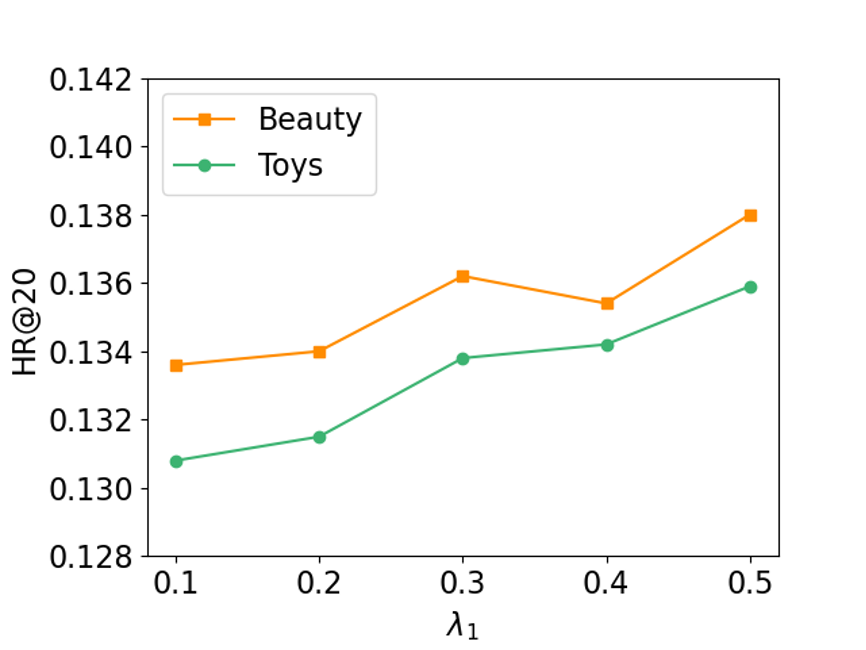
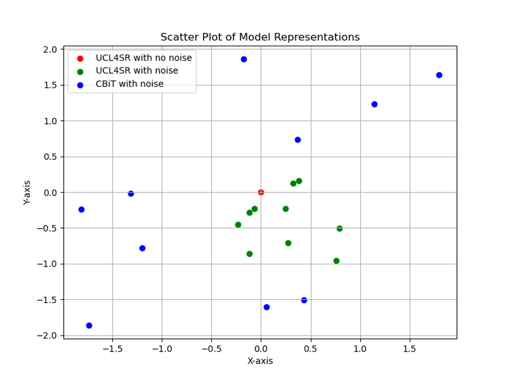
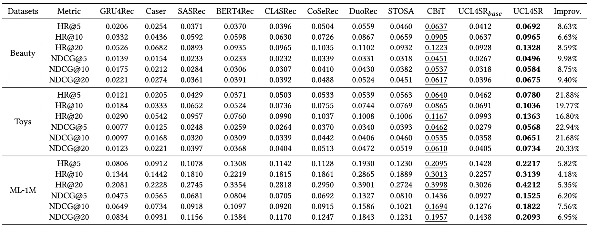

# UCL4SR
## Figure 1

## Figure 2

We first select an item representation from the trained UCL4SR as the anchor point, and then inject 10% noise data into UCL4SR 10 times to obtain 10 representations of the same item. We also apply the same operation to CBiT, and finally use T-SNE to dimensionally reduce all representations and draw this graph. It can be seen that UCL4SR can have better robustness in the face of noisy data.
## Figure 3

